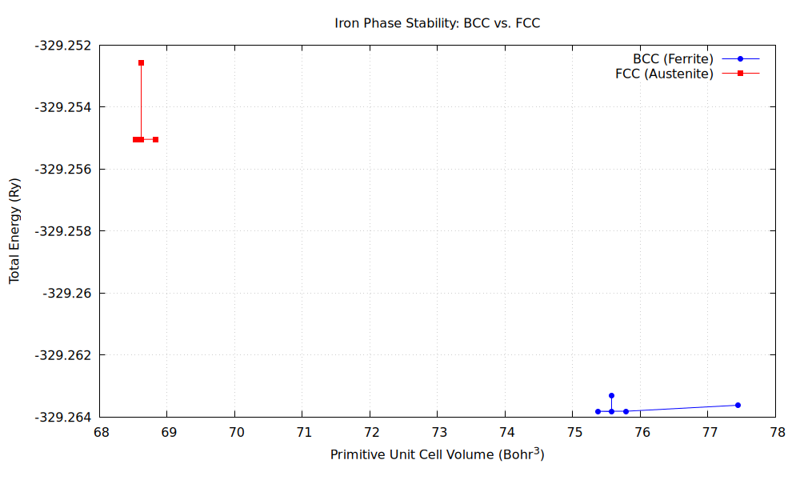

# Project-Iron-BCC-FCC-Phase-Stability
A Quantum ESPRESSO project to determine the relative stability of BCC and FCC iron from first principles. 
# Iron Phase Stability: A First-Principles DFT Study

This project computationally demonstrates a cornerstone of physical metallurgy: **at 0 Kelvin, the Body-Centered Cubic (BCC) crystal structure of iron (ferrite) is energetically more stable than the Face-Centered Cubic (FCC) structure (austenite).**

This finding is fundamentally important because it explains why steel is ferritic at room temperature, forming the basis for the vast majority of engineering alloys. By using Density Functional Theory (DFT) with Quantum ESPRESSO, we have reproduced this experimental fact from first principles, building a foundational understanding of iron's behavior.

---

## About The Project

This repository contains the necessary input files and analysis to calculate the equilibrium lattice constants and ground-state energies for both BCC and FCC iron. The project uses Quantum ESPRESSO for the DFT calculations and Gnuplot for data visualization.

### Built With
* [Quantum ESPRESSO](https://www.quantum-espresso.org/)
* [Gnuplot](http://www.gnuplot.info/)
* [SSSP Pseudopotentials](https://www.materialscloud.org/discover/sssp/table/efficiency)

## Methodology

A variable-cell relaxation (`vc-relax`) was performed for both the BCC and FCC primitive cells. This method optimizes both the ionic positions and the cell vectors to find the lowest-energy structure, thereby determining the equilibrium lattice constant and ground-state energy. Key parameters were kept identical across both calculations to ensure a fair comparison.

## Results

The calculations confirm that the minimum total energy of the BCC phase is lower than that of the FCC phase, indicating it is the more stable structure at 0K. The calculated Energy vs. Volume curves are shown below.



| Property                  | Calculated BCC (Ferrite) | Calculated FCC (Austenite) |
| :------------------------ | :----------------------: | :------------------------: |
| **Lattice Constant (Å)**  |          2.819           |           4.031            |
| **Total Energy (Ry)**     |       -329.2633          |         -329.2505          |


## How to Use This Repository

To reproduce these results, you will need a working installation of Quantum ESPRESSO.

### 1. Pseudopotentials

**This repository does not contain the pseudopotential file.** These files are managed by dedicated libraries. The pseudopotential used for this project is `Fe.pbe-spn-kjpaw_psl.0.2.1.UPF` from the [SSSP v1.1. PBE Efficiency library on Materials Cloud](https://www.materialscloud.org/discover/sssp/table/efficiency).

You must download this file and place it in the `Project_Iron/pseudo/` directory.

### 2. Input and Output Files

The repository contains the final, correct input files (`*.pwi`) for both the BCC and FCC calculations.

*   `Project_Iron/BCC/fe_bcc.pwi`
*   `Project_Iron/FCC/fe_fcc.pwi`

**Large output files (`*.pwo`) and temporary data (`*.save/`, `out/`) are not and should not be stored in the repository.** They are ignored by the `.gitignore` file. You can regenerate them by running the input files with `pw.x`.

### 3. Running the Calculation
Navigate to the appropriate directory and run:
```bash
pw.x -in fe_bcc.pwi > fe_bcc.pwo
